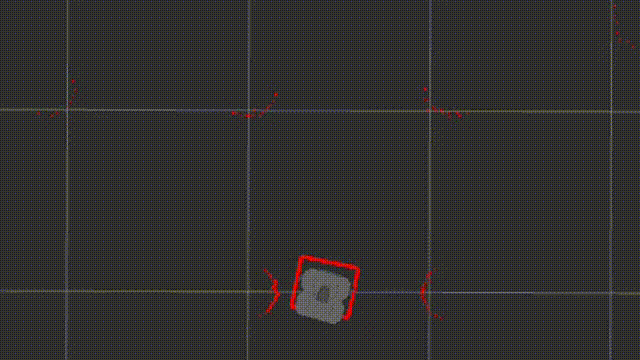

# Custom DWA Local Planner (ROS 2 Humble)

This package implements a **Dynamic Window Approach (DWA)** based local planner for the **TurtleBot3 Waffle model** in **ROS 2 Humble**.  
It calculates optimal linear and angular velocities in real time by simulating multiple motion trajectories, evaluating them through cost functions, and selecting the safest and most efficient path to navigate within a Gazebo environment.



---

## How DWA is Applied in This Code

The **Dynamic Window Approach (DWA)** is implemented in this package through the following key stages:

1. **State Representation**  
   The robot’s state is stored as a vector:  
   \[
   x = [x, y, \text{yaw}, v, \omega]
   \]  
   where `x` and `y` represent position, `yaw` is orientation, `v` is linear velocity, and `ω` is angular velocity.

2. **Dynamic Window Calculation**  
   Based on the robot’s current velocity, acceleration limits, and dynamic constraints, the algorithm computes a window of admissible velocities:  
   \[
   [v_{min}, v_{max}, \omega_{min}, \omega_{max}]
   \]  
   This ensures that all sampled motions are physically achievable within the robot’s capabilities.

3. **Trajectory Prediction**  
   For each possible combination of velocities `(v, ω)`, the future trajectory is simulated over a short prediction horizon (`PREDICT_TIME`) using the robot’s kinematic model.  
   The function `predict_trajectory()` propagates the motion to estimate where the robot would be after each time step.

4. **Cost Evaluation**  
   Each predicted trajectory is scored according to three criteria:
   - **Goal Cost:** Penalizes deviation in heading direction from the goal.
   - **Obstacle Cost:** Penalizes trajectories that approach or collide with obstacles, using distances derived from the LaserScan data.
   - **Speed Cost:** Encourages faster but safe movement by rewarding higher linear velocity.

   The total cost function is:
   \[
   J = \alpha \cdot C_{goal} + \beta \cdot C_{obstacle} + \gamma \cdot C_{speed}
   \]
   where α, β, and γ are weighting gains defined in the `Config` class.

5. **Command Selection and Execution**  
   The velocity pair `(v, ω)` with the **lowest total cost** is selected and published to `/cmd_vel`.  
   This controls the robot’s actual movement in the environment.

6. **Deadlock Prevention**  
   If all sampled trajectories are unsafe or the robot is stationary for too long, a **spin-in-place recovery** is triggered to escape potential deadlock situations.

---

# ⚙️ Build Instructions

```bash
# Create a new ROS 2 workspace
mkdir -p ~/custom_dwa/src
cd ~/custom_dwa/src

# Clone the custom DWA planner repository
git clone https://github.com/UmarIbrahim20/custom_DWA_LocalPlanner_for_Robot.git

# Return to the TurtleBot3 workspace (if applicable)
cd ~/custom_dwa/src/turtlebot3_ws

# Build the TurtleBot3 simulation packages
colcon build

# Return to the workspace root
cd ~/custom_dwa

# Build only the custom DWA planner package
colcon build --packages-select custom_dwa_local_planner

# (Optional) Build all packages again to ensure linking
colcon build

# Source the workspace
source install/setup.bash

# Set the TurtleBot3 model (choose: burger, waffle, or waffle_pi)
export TURTLEBOT3_MODEL=waffle

# Launch the TurtleBot3 Gazebo simulation environment
ros2 launch turtlebot3_gazebo turtlebot3_world.launch.py

# Launch RViz for visualization
rviz2 -d src/custom_dwa_local_planner/rviz/custom_rviz.rviz

# Run the custom DWA local planner node
ros2 run custom_dwa_local_planner custom_dwa_node


## Note

If you encounter issues with missing simulation models, environment variables, or Gazebo dependencies, please refer to the official TurtleBot3 Quick Start documentation for setup and troubleshooting:

[**TurtleBot3 Quick Start Guide**](https://emanual.robotis.com/docs/en/platform/turtlebot3/quick-start/)
